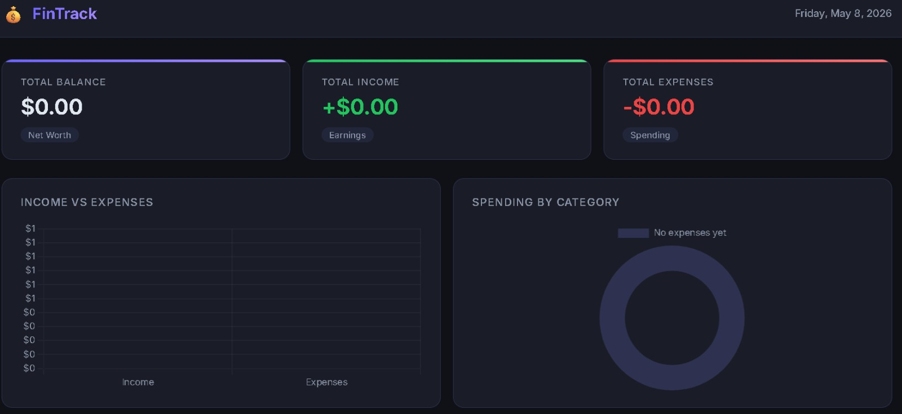
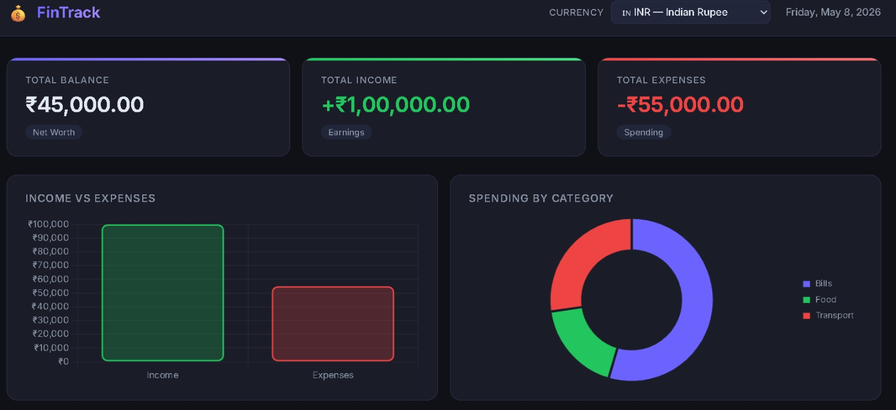
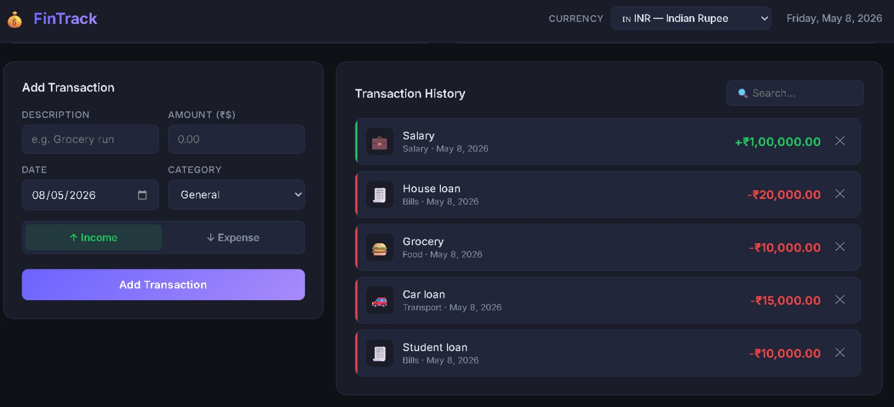

## 🚀 Live Demo
**[Click here to use FinTrack](https://shashwath100.github.io/Expense_tracker/)**
 
 # 💰 FinTrack — Personal Expense Tracker

A modern, fully client-side personal finance tracker built with vanilla HTML, CSS, and JavaScript. FinTrack helps you log income and expenses, visualize your spending habits with live charts, and manage your finances in your preferred currency — all without any backend or installation required.

---

## 🖥️ Live Preview

Open `index.html` directly in any modern browser. No server, no build step, no dependencies to install.

---

## ✨ Features

### 💳 Transaction Management
- Add income or expense transactions with a description, amount, date, and category
- Toggle between **Income** and **Expense** with a styled button group
- Delete any transaction instantly from the history list
- Transactions are sorted **newest first** for quick reference

### 📅 Date Field
- Each transaction records the exact date it occurred
- Date picker defaults to today for fast entry
- Dates are displayed in a human-readable format (e.g. `May 8, 2026`)

### 🏷️ Categories
Choose from 10 built-in categories, each with its own emoji icon:

| Category | Icon |
|---|---|
| General | 📋 |
| Food & Dining | 🍔 |
| Transport | 🚗 |
| Shopping | 🛍️ |
| Health | 💊 |
| Entertainment | 🎬 |
| Bills & Utilities | 🧾 |
| Salary | 💼 |
| Investment | 📈 |
| Other | 📦 |

### 🌍 Multi-Currency Support
Select your local currency from a dropdown in the header. All amounts — summary cards, charts, and transaction history — update instantly. Supports **20 currencies**:

| Currency | Code | Symbol |
|---|---|---|
| US Dollar | USD | $ |
| Indian Rupee | INR | ₹ |
| Euro | EUR | € |
| British Pound | GBP | £ |
| Japanese Yen | JPY | ¥ |
| Chinese Yuan | CNY | ¥ |
| UAE Dirham | AED | د.إ |
| Australian Dollar | AUD | A$ |
| Canadian Dollar | CAD | C$ |
| Singapore Dollar | SGD | S$ |
| Swiss Franc | CHF | Fr |
| Malaysian Ringgit | MYR | RM |
| Brazilian Real | BRL | R$ |
| South African Rand | ZAR | R |
| Mexican Peso | MXN | MX$ |
| Indonesian Rupiah | IDR | Rp |
| Pakistani Rupee | PKR | ₨ |
| Bangladeshi Taka | BDT | ৳ |
| Nigerian Naira | NGN | ₦ |
| South Korean Won | KRW | ₩ |

Your selected currency is **saved to localStorage** and remembered on your next visit.

### 📊 Live Charts (Chart.js)
Two charts update in real time as you add or remove transactions:

- **Income vs Expenses Bar Chart** — side-by-side comparison of total earnings and total spending
- **Spending by Category Doughnut Chart** — visual breakdown of where your money goes, color-coded by category

### 🔍 Search & Filter
- Instantly filter the transaction history by typing a description or category name into the search bar

### 💾 Persistent Storage
- All transactions and currency preference are saved to **localStorage**
- Your data survives page refreshes and browser restarts with zero setup

---

## 📁 Project Structure

```
fintrack/
├── index.html        # App markup — header, summary cards, charts, form, history
├── style.css         # Dark theme styles, layout, responsive breakpoints
├── script.js         # All app logic — state, rendering, charts, currency, storage
└── README.md         # Project documentation
```

---

## 🛠️ Tech Stack

| Technology | Purpose |
|---|---|
| HTML5 | Semantic app structure |
| CSS3 | Dark theme, CSS variables, Grid & Flexbox layout |
| Vanilla JavaScript (ES6+) | App logic, DOM manipulation, localStorage |
| [Chart.js v4](https://www.chartjs.org/) | Bar and doughnut charts |
| [Google Fonts — Inter](https://fonts.google.com/specimen/Inter) | Typography |
| `Intl.NumberFormat` API | Locale-aware currency formatting |

No frameworks. No build tools. No npm. Just open and use.

---

## 🚀 Getting Started

1. **Clone or download** this repository
2. Open `index.html` in your browser

```bash
git clone https://github.com/your-username/fintrack.git
cd fintrack
# Open index.html in your browser
```

That's it. No `npm install`, no build step.

---

## 📱 Responsive Design

FinTrack is fully responsive:
- **Desktop** — 3-column summary cards, side-by-side charts, form + history layout
- **Tablet** — stacked single-column layout
- **Mobile** — compact padding, single-column form fields, readable card values

---

## 🗂️ How to Use

1. **Select your currency** from the dropdown in the top-right header
2. **Fill in the form** — enter a description, amount, date, and category
3. **Choose Income or Expense** using the toggle buttons
4. Click **Add Transaction** — the summary cards and charts update instantly
5. Use the **search bar** to filter your history
6. Click **✕** on any transaction to delete it

---

## 🔒 Privacy

All data is stored **locally in your browser** using `localStorage`. Nothing is sent to any server. Clearing your browser data will erase your transactions.

---

## 📄 License

## 📸 Project Screenshots

### Dashboard View


### Add New Transaction


### Transaction History



This project is open source and available under the [MIT License](LICENSE).
## 📸 Project Screenshots

### Dashboard View


### Add New Transaction


### Transaction History

